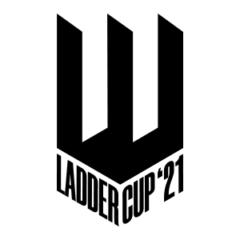
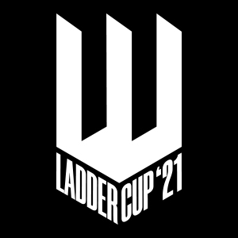
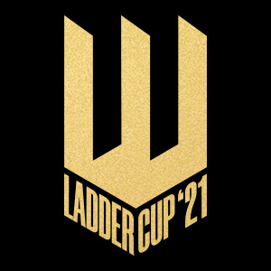
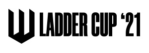
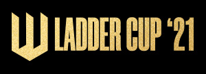

La impresión que debe dar el logo es de escalones que representan el camino que tienen que dar los equipos para coronarse como campeones, de la misma forma el logo tiene un aspecto de corona.

También representa un juego visual de perspectivas que hace que siempre se dibuje una figura distinta según como se lo vea.

A continuación detallamos sus distintas aplicaciones.

## Logo en negro

Este logo es funcional para cuando se requiere de claridad y no de impacto visual, como por ejemplo legales, marcas de agua, etc.

--------

## Logo en blanco

Legales, marcas de agua, etc.

--------
## Logo en dorado

Este logo debe usarse cuando se necesite mayor fortaleza de imagen sobre todo cuando va a estar sólo. Este es el logo principal para redes sociales sobre todo. Este logo incluye un gradiente y una textura.

---

# Variaciones

También el logo tiene distintas variaciones para cuando la pieza en la que tiene que ser insertado no es adecuada.

## Horizontales

