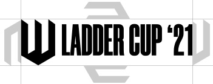
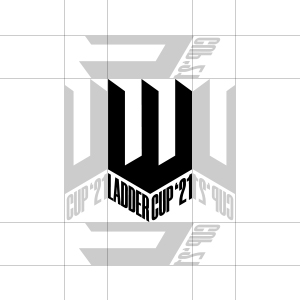
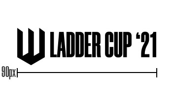
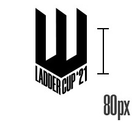
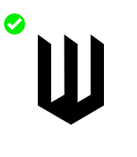
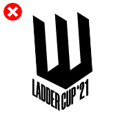
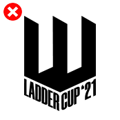
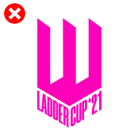
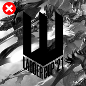

La impresión que debe dar el logo es de escalones que representan el camino que tienen que dar los equipos para coronarse como campeones, de la misma forma el logo tiene un aspecto de corona.

También representa un juego visual de perspectivas que hace que siempre se dibuje una figura distinta según como se lo vea.

A continuación detallamos sus distintas aplicaciones.

 

## Logo en negro

Este logo es funcional para cuando se requiere de claridad y no de impacto visual, como por ejemplo legales, marcas de agua, etc.

--------
 

## Logo en blanco

Legales, marcas de agua, etc.

--------
 

## Logo en dorado

Este logo debe usarse cuando se necesite mayor fortaleza de imagen sobre todo cuando va a estar sólo. Este es el logo principal para redes sociales sobre todo. Este logo incluye un gradiente y una textura.

  

# Variaciones

También el logo tiene distintas variaciones para cuando la pieza en la que tiene que ser insertado no es adecuada.

## Horizontales
 

 
 

  

 
 
 

# Espaciado

Un mínimo de espacio fue creado para asegurar la visibilidad del logo. A tener en cuenta para el vertical es el 50% del isologotipo y para la versión horizontal el 50% del isologo   

  

  
 

# Permitidos

El mínimo de ancho permitido es de 90px

El mínimo de alto permitido es de 80px

Cuando la imagen sea muy pequeña y la legibilidad del título de la copa se vea comprometida puede utilizarse sólo el símbolo.

 
 
 

# No permitidos

 

No re ordenar el logo, siempre tiene que estar centrado

No estirar el logo ya que se deforma la perspectiva

No utilizar colores estridentes en el logo

Siempre privilegiar el contraste para que el logo sea visible

